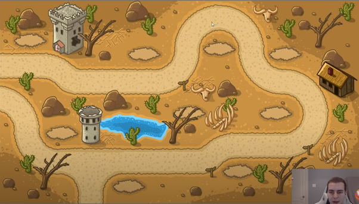

# Tim Tower Defence 
## Links 
* [You tube tutorial](https://www.youtube.com/watch?v=iLHAKXQBOoA)
* [Github](https://github.com/techwithtim/Tower-Defense-Game)
* [Pygame](https://www.pygame.org/news)
* [Assets](https://craftpix.net/product/tower-defense-2d-game-kit/)

## Notes
* the background png is 1350 by 700 made up of tiles from the asset library 
* and it looks like this 
## Todo 
* fix the heart image to have a proper transparent background

## Enemies 
* self.enemies = [Scorpion(), Club(), Wizard()]

## Tower locations
* TOWER POSITIONS = [(119, 130), (539, 184), (811, 159), (1085, 176), (1044, 381), (696, 381), (231, 458), (493, 630), (900, 584)]

## path info 
* self.path = [(375, 747), (381, 474), (423, 462), (460, 424), (463, 297), (591, 293), (620, 280), (630, 252), (639, 158), (661, 131), (770, 129), (790, 138), (804, 134)]
* self.path = [(1, 225), (200, 231), (280, 280), (644, 263), (666, 231), (683, 193), (710, 121), (755, 80), (787, 47), (868, 58), (909, 93), (937, 154), (936, 195), (967, 231), (994, 263), (1013, 273), (1074, 278), (1119, 297), (1154, 331), (1169, 370), (1173, 414), (1141, 452), (1106, 495), (843, 507), (785, 535), (748, 552), (696, 551), (551, 550), (193, 546), (135, 504), (92, 432), (51, 361), (5, 339)] 
* self.path = [(1, 341), (71, 376), (95, 437), (110, 488), (134, 528), (166, 551), (768, 554), (801, 524), (851, 501), (1090, 498), (1138, 476), (1160, 437), (1170, 398), (1171, 360), (1156, 331), (1125, 304), (1082, 291), (1044, 282), (1007, 266), (975, 246), (950, 220), (927, 165), (914, 117), (875, 71), (819, 48), (770, 69), (735, 97), (716, 137), (705, 190), (674, 230), (646, 262), (239, 263), (191, 236), (145, 234), (9, 233), (2, 236)]
* self.path =[(380, 743), (384, 631), (386, 477), (465, 437), (471, 336), (450, 301), (153, 297), (131, 338), (130, 422), (152, 454), (168, 463), (212, 497), (211, 590), (252, 629), (381, 630), (377, 741)]
* self.path = [(460, 401), (460, 401), (460, 401), (460, 401), (460, 401), (460, 401), (460, 401), (460, 401), (460, 401)]
* self.path = [(698, 417), (122, 419), (117, 286), (682, 287), (698, 417)]
* self.path = [(-10, 224),(19, 224), (177, 235), (282, 283), (526, 277), (607, 217), (641, 105), (717, 57), (796, 83), (855, 222), (973, 284), (1046, 366), (1022, 458), (894, 492), (740, 504), (580, 542), (148, 541), (10, 442), (-10, 335), (-100, 345)]

game_assets\td-gui\PNG\menu\button_settings.png
game_assets\td-gui\PNG\settings\button_close.png
game_assets\td-gui\PNG\upgrade\button_done.png
game_assets\td-gui\PNG\upgrade\window_3.png
game_assets\td-gui\PNG\menu\button_play.png
game_assets\td-gui\PNG\achievement\normal_window.png
game_assets\td-gui\PNG\achievement\star.png